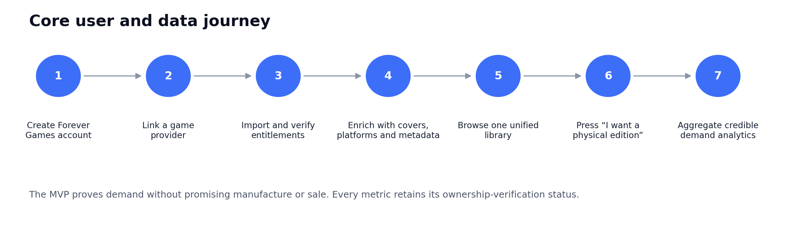
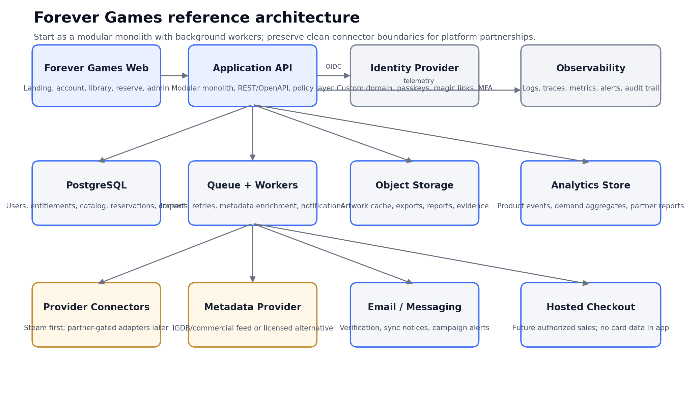
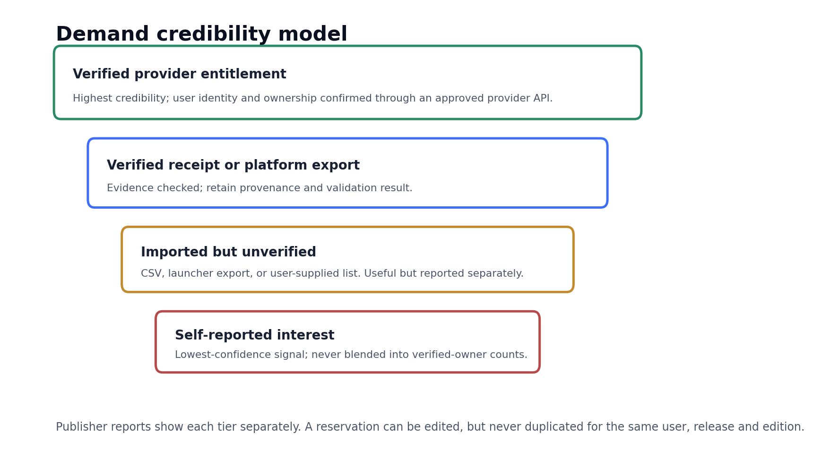

<!--
Forever Games Portal Build Specification
Version: 1.0
Status: Build-ready MVP specification
Source: Converted from the approved DOCX specification.
-->

# Forever Games

## Portal Build Specification and Agent Execution Manual
**Your games. Your legacy.**

A build-ready product, system design, testing, security, and deployment specification

| **Version**           | 1.0                                                                                                       |
|-----------------------|-----------------------------------------------------------------------------------------------------------|
| **Status**            | Build-ready MVP specification                                                                             |
| **Primary audience**  | Product owner, coding agents, engineers, designers, QA, security, legal and prospective platform partners |
| **Research cutoff**   | July 13, 2026                                                                                             |
| **Primary objective** | Build a functional demand-validation portal before manufacturing or platform authorization                |

*Planning note: “Forever Games” requires trademark, domain, and platform-brand clearance before public launch.*

# Document Control

| **Field**            | **Specification**                                                                                                                                                                            |
|----------------------|----------------------------------------------------------------------------------------------------------------------------------------------------------------------------------------------|
| Purpose              | Define the complete MVP and production-ready path for the Forever Games portal, including product behavior, architecture, data, APIs, security, testing, deployment and agent work packages. |
| Authoritative scope  | This document is the baseline. Architecture changes require an Architecture Decision Record (ADR) and product-owner approval.                                                                |
| Intended build style | Modular monolith plus background workers. Avoid premature microservices.                                                                                                                     |
| Launch posture       | Demand validation only. No manufacture, preorder, deposit or guaranteed delivery until rights and platform authorization exist.                                                              |
| Review cadence       | Review after every completed work package and formally at the end of each release milestone.                                                                                                 |

<table>
<colgroup>
<col style="width: 100%" />
</colgroup>
<thead>
<tr class="header">
<th>
<strong>Critical feasibility decision</strong>

The portal must not assume that every gaming provider exposes a public SSO and full-library entitlement API. Steam is the recommended first verified connector. Other providers are implemented as disabled adapters until partnership credentials and permitted scopes are obtained.
</th>
</tr>
</thead>
<tbody>
</tbody>
</table>

## How to Use This Manual

1.  Read Sections 1-7 before changing product scope or architecture.

2.  Use Section 18 as the ordered agent backlog. Do not skip dependencies.

3.  Use Section 16 and Appendix B as the release test catalog and quality gate.

4.  Record every material design decision in /docs/adr and update this specification when behavior changes.

5.  Do not scrape, reverse-engineer or automate restricted platform endpoints. Use only documented APIs, user-provided exports, or written partner authorization.

# Static Table of Contents

1. Executive Summary

2. Product Vision and Scope

3. Branding and Experience System

4. Personas and User Journeys

5. Provider and Metadata Integration Reality

6. Functional Requirements

7. Reference Architecture

8. Domain and Data Model

9. API and Integration Contracts

10. Analytics and Demand Credibility

11. Security Architecture

12. Privacy, Legal and Commercial Guardrails

13. DevOps, Environments and Observability

14. Performance, Accessibility and Reliability

15. Test Strategy

16. Acceptance Test Catalog

17. Release and Operations Runbook

18. Ordered Agent Work Packages

19. Future Manufacturing and Partner Expansion

20. Launch Checklist

Appendices and References

# 1. Executive Summary

Forever Games is a branded, cross-platform game-library portal that lets a user create a Forever Games account, connect supported gaming accounts behind it, import owned or accessible titles, enrich those titles with licensed metadata and imagery, and express non-binding demand for authorized physical editions. The first product objective is not disc manufacturing. It is to produce credible, auditable market evidence that players will purchase physical versions of games they already access digitally.

The strongest product asset is a normalized library and entitlement dataset tied to explicit user consent and separated by verification quality. Platform holders and publishers should be able to see, for example, how many verified owners requested a title, the price ranges they selected, their regions, their preferred edition formats, and how those signals changed over time. Self-reported interest remains useful, but it must never be blended into verified-owner counts.

The MVP should launch with a first-party Forever Games account and a Steam connector because Steam publicly documents website account linking through OpenID and an owned-games endpoint, subject to the user’s game-detail privacy settings. \[R1\]\[R2\] Console, Epic, and GOG integrations must be treated as partner-gated until the relevant platform grants appropriate access; their public developer documentation is generally oriented toward a developer verifying ownership of its own titles rather than reading a consumer’s entire library. \[R3\]\[R4\]\[R5\]\[R6\]\[R7\]\[R8\]

<table>
<colgroup>
<col style="width: 100%" />
</colgroup>
<thead>
<tr class="header">
<th>
<strong>Recommended MVP</strong>

Branded Forever Games identity + Steam verified import + licensed metadata + manual/CSV import with lower confidence + unified library + one-click “I want a physical edition” reservation + internal demand analytics + admin review tools.
</th>
</tr>
</thead>
<tbody>
</tbody>
</table>

## 1.1 MVP Outcomes

- A user can create and securely access a Forever Games account on a Forever Games domain.

- A user can connect Steam without sharing a Steam password with Forever Games.

- The system imports available owned-game data, records source and freshness, and reconciles later syncs.

- Every game is normalized to a canonical catalog record and displayed with properly licensed metadata and imagery.

- A user can reserve interest once per game release and edition, change preferences, or remove the reservation.

- Analytics distinguish verified ownership, verified evidence, imported-unverified ownership, subscription access, and self-reported interest.

- Administrators can audit imports, mappings, reservations, consent, failed jobs, and aggregate demand.

- The platform can add partner connectors later without rewriting the core account, library or reservation system.

## 1.2 Explicit Non-Goals for MVP

- Producing, burning, replicating or shipping playable console media.

- Claiming that a digital license legally equals ownership or creates a statutory right to a physical copy.

- Collecting deposits, preorders or card data before an authorized product exists.

- Using PlayStation, Xbox, Nintendo, Epic, GOG, publisher or game logos outside permitted brand and metadata terms.

- Scraping private libraries, automating consumer credentials, bypassing platform controls, or reverse-engineering authentication.

- Building social feeds, chat, trading, resale, inheritance or a public marketplace in the first release.

## 1.3 Core Product Principles

| **Principle**                       | **Implementation meaning**                                                                                                                      |
|-------------------------------------|-------------------------------------------------------------------------------------------------------------------------------------------------|
| Own the relationship                | The user authenticates to a Forever Games account first. Linked providers are data connections, not the primary identity.                       |
| Verified demand over vanity metrics | Every dashboard exposes evidence quality. A million unverified clicks must not be marketed as a million verified buyers.                        |
| Truthful access language            | “Owned,” “subscription access,” “free-to-play,” “imported,” and “self-reported” are different states.                                           |
| Least privilege                     | Request the smallest provider scopes needed. Store no provider passwords and minimize long-lived tokens.                                        |
| Consent and reversibility           | Users can disconnect providers, revoke consent, export data and delete their account.                                                           |
| Monolith first                      | Build one deployable application with well-defined modules and workers. Split services only when scale or organizational boundaries justify it. |
| Partner ready                       | Connector contracts, audit trails, brand controls and data provenance are designed from day one for platform review.                            |

# 2. Product Vision and Scope

## 2.1 Product Statement

<table>
<colgroup>
<col style="width: 100%" />
</colgroup>
<thead>
<tr class="header">
<th>
<strong>Product statement</strong>

Forever Games is the permanent index of a player’s gaming library and the trusted demand layer for authorized physical preservation. Users connect their libraries, understand what they have, and tell publishers which games they would buy physically.
</th>
</tr>
</thead>
<tbody>
</tbody>
</table>

## 2.2 Product Surfaces

| **Surface**                     | **Primary purpose**                                                                                     | **MVP?** |
|---------------------------------|---------------------------------------------------------------------------------------------------------|----------|
| Public marketing site           | Explain the mission, build trust, show approved aggregate demand and convert visitors to accounts.      | Yes      |
| Forever Games account portal    | Account, onboarding, connections, consent, library, title details, reservations and personal analytics. | Yes      |
| Admin console                   | Manage users, connectors, jobs, mappings, catalog, reservations, abuse, consent and exports.            | Yes      |
| Publisher/platform portal       | Private demand dashboards, report exports, campaign approvals and title-level analytics.                | Phase 2  |
| Checkout and order portal       | Authorized sale, tax, shipping, order status and customer service.                                      | Phase 3  |
| Manufacturing operations portal | Media authorization, serial assignment, production, QA, shipment and revocation.                        | Future   |

## 2.3 Suggested Success Metrics

Targets must be approved by the product owner after a pilot baseline. The product should instrument the following from the first beta:

- Account activation rate: completed Forever Games account / sign-up starts.

- Provider connection rate: users with at least one linked provider / activated users.

- Import success rate and median time to first visible library item.

- Percentage of library items with a canonical catalog match.

- Reservation rate per verified library item and per active user.

- Price-selection completion rate and edition-preference distribution.

- 30-day return rate for users who connected a provider.

- Connector error rate, sync freshness and manual-review backlog.

- Deletion/export request completion time and support contact rate.

## 2.4 Product Roles

| **Role**        | **Capabilities**                                                                                                |
|-----------------|-----------------------------------------------------------------------------------------------------------------|
| Visitor         | View landing pages, approved aggregate statistics, FAQs and sign-up.                                            |
| Member          | Manage account and consent; connect providers; view/import library; reserve interest; export/delete own data.   |
| Support agent   | View limited user support data, sync history and reservation status; cannot view secrets or bulk analytics.     |
| Catalog curator | Resolve mappings, edit catalog overrides and approve metadata assets.                                           |
| Analyst         | View aggregate de-identified demand and generate reports; no provider tokens or direct user credentials.        |
| Administrator   | Manage users, roles, jobs, feature flags, providers and incidents; privileged actions require MFA and auditing. |
| Partner user    | View only approved publisher/platform data for authorized titles and territories.                               |

# 3. Branding and Experience System

## 3.1 Brand Position

Forever Games should feel like a trusted archive and premium library, not a neon gaming forum. The emotional center is permanence, pride of collection, and respectful preservation. The visual system should combine the confidence of a vault, the calm organization of a library, and the familiarity of a modern media catalog.

## 3.2 Naming and Messaging

| **Element**        | **Recommendation**                                                                      | **Usage note**                                                           |
|--------------------|-----------------------------------------------------------------------------------------|--------------------------------------------------------------------------|
| Brand name         | Forever Games                                                                           | Run trademark, domain and social-handle clearance before public use.     |
| Primary tagline    | Your games. Your legacy.                                                                | Safer for the MVP because it does not imply a legal ownership guarantee. |
| Campaign line      | Own your games. Forever.                                                                | Strong emotional line; legal review required before use as a promise.    |
| Reserve CTA        | I want a physical edition                                                               | Clearer and less legally loaded than “preorder” or “buy.”                |
| Reserve disclosure | This is a non-binding expression of interest. No product is currently offered for sale. | Display before confirmation and in confirmation email.                   |

## 3.3 Visual Tokens

| **Token**      | **Value** | **Purpose**                                         |
|----------------|-----------|-----------------------------------------------------|
| Vault Navy     | \#0B1020  | Primary background, headings, trust and permanence. |
| Archive Blue   | \#3D6EF7  | Primary action, focus, links and selected states.   |
| Silver         | \#B7C0D0  | Secondary text, borders and metallic archive cues.  |
| Library White  | \#F4F6FA  | Main light background and cards.                    |
| Verified Green | \#2B8A66  | Verified entitlement and successful sync.           |
| Evidence Amber | \#C38A2E  | Imported/unverified state and warnings.             |
| Risk Red       | \#B64A4A  | Errors, revoked access and destructive actions.     |

## 3.4 Typography and Components

- Use a highly legible sans-serif family. Production web recommendation: Inter or another licensed/system-safe equivalent. The document uses Liberation Sans for portability.

- Use generous spacing, 8-pixel layout increments, clear card boundaries, and no dense “gamer RGB” effects.

- Cover art is the dominant imagery. Reserve motion for sync progress, confirmation, and subtle library transitions.

- All provider marks must come from approved brand kits and must not imply partnership before authorization.

- Core components: navigation shell, provider connection card, library card, verification badge, filter bar, reservation drawer, price selector, status timeline, privacy/consent panel, admin table and analytics tile.

## 3.5 Required Screens

| **Screen**            | **Required content**                                                                                                        |
|-----------------------|-----------------------------------------------------------------------------------------------------------------------------|
| Landing               | Mission, value proposition, how it works, trust/privacy, supported connections, sample analytics, FAQ, sign-up.             |
| Forever Games sign-in | Email/passkey or approved social identity, legal links, age confirmation, recovery.                                         |
| Onboarding            | Display name, region, privacy choices, provider connection invitation and tour.                                             |
| Connections           | Provider cards, connection status, scopes, last sync, sync now, disconnect and data-retention choice.                       |
| Library               | Cover grid/list, search, filters, grouping, ownership badges, data freshness and empty states.                              |
| Game detail           | Hero art, canonical metadata, platform releases, ownership evidence, physical status, reservation CTA and community demand. |
| Reservation           | Edition, target price, platform preference, region, optional comments, disclosure and confirmation.                         |
| Legacy dashboard      | Counts, earliest purchase, genres, platforms, verified percentage, reserved titles and preservation status.                 |
| Settings/privacy      | Profile, sessions, MFA, consent, export, deletion, notification preferences and connected accounts.                         |
| Admin                 | Jobs, mappings, users, reservations, catalog, feature flags, abuse, reports and audit logs.                                 |

# 4. Personas and User Journeys

## 4.1 Primary Personas

| **Persona**            | **Need**                                                                             | **Design implication**                                                    |
|------------------------|--------------------------------------------------------------------------------------|---------------------------------------------------------------------------|
| Digital collector      | Wants one view of a fragmented library and confidence that purchases are remembered. | Fast import, rich covers, duplicates grouped, provenance visible.         |
| Physical collector     | Wants tangible editions without inventory speculation.                               | Edition and price preferences, numbered demand, alerting.                 |
| Preservation advocate  | Wants at-risk and digital-only games surfaced.                                       | Preservation status, delisting notes, transparent sourcing.               |
| Publisher analyst      | Wants credible, segmented demand rather than petitions.                              | Verified-owner filters, regions, price curves and exportable methodology. |
| Support/admin operator | Needs to resolve failed imports and bad mappings quickly.                            | Traceable jobs, replay, audit logs and safe override tools.               |

## 4.2 Golden Path

## 4.3 Main User Flow

6.  Visitor opens forevergames.com and chooses Create My Vault.

7.  User creates a Forever Games account on the Forever Games domain using passkey, magic link, or approved identity-provider login.

8.  User accepts Terms, Privacy Notice, age requirement and optional analytics/marketing consent separately.

9.  User opens Connections and selects Steam.

10. Browser redirects to Steam’s official OpenID page; Forever Games never receives the Steam password. \[R1\]

11. After callback validation, a background sync imports accessible owned-game information. If Steam game details are private, the UI explains the limitation and offers privacy instructions or manual import. \[R2\]

12. Catalog enrichment maps provider app IDs to canonical game and release records and retrieves licensed imagery/metadata.

13. Library appears progressively; unmatched items are shown with a temporary provider title and queued for mapping.

14. User opens a game and presses I want a physical edition.

15. User selects edition and target price, confirms the non-binding disclosure, and submits.

16. Analytics records a single reservation keyed to the user, canonical release and edition. Repeating the action edits the existing preference rather than creating another vote.

17. User receives confirmation and can manage all reservations from the dashboard.

## 4.4 Failure and Recovery Flows

| **Scenario**            | **User experience**                                                                                     | **System behavior**                                                                                        |
|-------------------------|---------------------------------------------------------------------------------------------------------|------------------------------------------------------------------------------------------------------------|
| Provider callback fails | Return to Connections with a plain-language error and retry.                                            | Do not create a connection; log correlation ID without secrets.                                            |
| Private Steam library   | Explain that owned-game details are not visible; offer retry after privacy change or unverified import. | Connection may remain linked; sync status is BLOCKED_PRIVACY.                                              |
| Rate limit              | Show sync queued and expected retry behavior.                                                           | Honor Retry-After, exponential backoff, jitter and circuit breaker.                                        |
| Metadata no match       | Show provider title and placeholder image.                                                              | Create unresolved mapping task; do not silently guess.                                                     |
| Duplicate catalog match | Group only when confidence threshold is met.                                                            | Queue curator review when ambiguous.                                                                       |
| Reservation duplicate   | Open existing reservation for edit.                                                                     | Unique database constraint prevents duplicates.                                                            |
| Disconnect provider     | Explain data options and consequences.                                                                  | Revoke token immediately; delete or retain derived snapshot according to explicit choice and policy.       |
| Account deletion        | Confirm destructive action and legal retention exceptions.                                              | Queue deletion workflow, revoke sessions/tokens, remove personal data and record minimal compliance audit. |

# 5. Provider and Metadata Integration Reality

This section is intentionally conservative. Platform integration terms and scopes can change, and undocumented access is not a product dependency. Every connector remains behind a feature flag until credentials, terms, data-retention rules and platform branding have been reviewed.

## 5.1 Integration Feasibility Matrix (as of July 13, 2026)

| **Provider**           | **Access**                                      | **Reality**                                                                                                                                                                                             | **Build decision**                                     |
|------------------------|-------------------------------------------------|---------------------------------------------------------------------------------------------------------------------------------------------------------------------------------------------------------|--------------------------------------------------------|
| Forever Games identity | Yes                                             | Use a managed customer-identity service with a Forever Games custom domain and branded UI. Prefer passkeys/magic links; avoid storing passwords when possible.                                          | MVP                                                    |
| Steam                  | Partially public                                | Steam documents website linking through OpenID. GetOwnedGames can return a player’s owned games if game details are visible. \[R1\]\[R2\]                                                               | MVP verified connector                                 |
| Xbox/Microsoft         | Partner/title oriented                          | Xbox services and entitlement APIs are documented within the GDK and publisher/service context. Service-to-service entitlement queries are intended for central publisher scenarios. \[R3\]\[R4\]       | Partner-gated adapter                                  |
| PlayStation            | Partner gated                                   | Official public material directs developers/publishers to PlayStation Partners; no general-purpose public consumer-library API was identified in the reviewed public documentation. \[R9\]              | Partner-gated adapter                                  |
| Nintendo               | Developer portal gated                          | Nintendo provides a developer portal for building/publishing software; treat consumer-library access as unavailable until Nintendo grants specific scopes. \[R7\]                                       | Partner-gated adapter                                  |
| Epic Games             | Product/ecommerce oriented                      | Epic Account Services supports OAuth, while Ecom ownership APIs verify entitlements in an Epic Games Store product context rather than a general whole-account library export. \[R5\]\[R6\]             | Partner-gated; do not promise full import              |
| GOG                    | Game-SDK oriented                               | GOG GALAXY supports authentication and license checks for a game using product credentials; public docs do not establish a general web API for importing an arbitrary user’s entire GOG library. \[R8\] | Partner-gated or user export                           |
| IGDB metadata          | Technically suitable; commercial terms required | IGDB exposes games, covers, screenshots, platforms, companies and related metadata. Its docs state free use is non-commercial and commercial use requires a partnership. \[R10\]                        | Obtain commercial agreement or alternate licensed feed |
| Manual CSV/export      | Yes                                             | User uploads a supported export. Data is labeled imported-unverified unless evidence is validated.                                                                                                      | MVP fallback                                           |

<table>
<colgroup>
<col style="width: 100%" />
</colgroup>
<thead>
<tr class="header">
<th>
<strong>Do not design around imaginary APIs</strong>

The connector framework must support “not available,” “partner pending,” and “manual import only” as first-class states. A polished disabled provider card with a waitlist is better than an unsupported integration.
</th>
</tr>
</thead>
<tbody>
</tbody>
</table>

## 5.2 Connector Contract

Every provider adapter implements the same internal contract while remaining isolated from the rest of the application:

<table>
<colgroup>
<col style="width: 100%" />
</colgroup>
<thead>
<tr class="header">
<th>interface ProviderConnector { 
provider: ProviderCode 
capabilities(): Capability[] 
beginConnection(userId, returnUrl): Promise&lt;RedirectInstruction&gt; 
completeConnection(callback): Promise&lt;ConnectionResult&gt; 
refreshCredential(connectionId): Promise&lt;CredentialResult&gt; 
syncEntitlements(connectionId, cursor?): Promise&lt;SyncPage&gt; 
disconnect(connectionId): Promise&lt;void&gt; 
healthCheck(): Promise&lt;ConnectorHealth&gt; 
}</th>
</tr>
</thead>
<tbody>
</tbody>
</table>

Capabilities are declarative: AUTHENTICATE, PROFILE_READ, LIBRARY_READ, ENTITLEMENT_VERIFY, PLAYTIME_READ, ACHIEVEMENTS_READ, DLC_READ, PURCHASE_DATE_READ, RECEIPT_EXPORT and WEBHOOKS. The UI must render only capabilities actually granted.

## 5.3 Steam MVP Behavior

- Use Steam OpenID only for identity linking. Validate the OpenID response server-side, verify return_to and realm, and extract the 64-bit Steam ID. \[R1\]

- Call GetOwnedGames from the server, never from the browser. Respect user privacy and provider rate limits. \[R2\]

- Request app info when permitted, but treat provider names/icons as provisional metadata. Canonical metadata comes from the licensed catalog layer.

- Store Steam ID, provider connection metadata and encrypted credentials/API material. Do not store Steam passwords.

- Record sync page, response time, item count, provider correlation data, retry state and final outcome.

- When game details are private, return a specific BLOCKED_PRIVACY state rather than zero games.

## 5.4 Metadata Licensing

Game titles, descriptions, covers, screenshots, ratings, release dates, publishers and platform associations are not “free data” merely because they are visible online. The build must support a licensed metadata provider, publisher-supplied assets and internal overrides. IGDB is a strong technical candidate, but its public documentation requires a commercial partnership for commercial use. \[R10\]

| **Metadata source**        | **Precedence** | **Rules**                                                                     |
|----------------------------|----------------|-------------------------------------------------------------------------------|
| Publisher/platform feed    | 1              | Authoritative for approved titles and artwork; retain contract/source ID.     |
| Licensed metadata provider | 2              | Use according to commercial terms, attribution and caching limits.            |
| Provider connector payload | 3              | Useful for mapping and display fallback; do not assume redistribution rights. |
| Curator override           | 4              | Must include reason, editor, timestamp and source evidence.                   |
| User contribution          | 5              | Never publish without moderation and rights policy.                           |

# 6. Functional Requirements

## 6.1 Forever Games Account and Authentication

| **ID**  | **Requirement**                                                                                                                                        |
|---------|--------------------------------------------------------------------------------------------------------------------------------------------------------|
| AUTH-01 | The sign-in and sign-up experience is hosted on a Forever Games domain and uses Forever Games branding.                                                |
| AUTH-02 | The system supports passkeys and email magic links at launch; password login is optional and should be avoided unless business requirements demand it. |
| AUTH-03 | Users can enable MFA; privileged staff roles require MFA.                                                                                              |
| AUTH-04 | Sessions are revocable individually and globally. The account page shows active sessions with device, approximate region and last activity.            |
| AUTH-05 | Account recovery must not depend on a linked game provider.                                                                                            |
| AUTH-06 | Sign-up records acceptance versions for Terms, Privacy Notice, age confirmation and optional consents.                                                 |
| AUTH-07 | The system prevents email enumeration and rate-limits authentication workflows.                                                                        |

## 6.2 Provider Connections

| **ID**  | **Requirement**                                                                                                                          |
|---------|------------------------------------------------------------------------------------------------------------------------------------------|
| CONN-01 | A user can view available, connected, pending, blocked and partner-waitlist providers.                                                   |
| CONN-02 | Each provider card shows granted capabilities, last successful sync, last error, next retry and disconnect action.                       |
| CONN-03 | OAuth/OpenID state, nonce and PKCE are used where supported; callback replay is rejected.                                                |
| CONN-04 | Provider tokens are encrypted, access is audited, and token values never appear in logs, analytics or support tools.                     |
| CONN-05 | Disconnect revokes provider authorization when supported and immediately prevents further syncs.                                         |
| CONN-06 | A user cannot connect the same external provider account to two Forever Games accounts without an explicit conflict-resolution workflow. |
| CONN-07 | Provider additions and scope changes are feature-flagged and require legal/security review.                                              |

## 6.3 Import, Sync and Reconciliation

- Initial sync begins immediately after connection and runs asynchronously.

- Library UI renders partial results as pages complete; the user never waits on a long synchronous request.

- Each entitlement record stores provider, external product ID, external user ID hash/reference, acquisition/access type, verification level, first seen, last seen, source payload hash and last sync run.

- Sync is idempotent. Replaying the same page produces no duplicate entitlement or analytics events.

- Reconciliation marks missing items as NOT_SEEN rather than deleting immediately. After a provider-specific grace period, status can become REMOVED_OR_INACCESSIBLE.

- Provider subscription items are labeled SUBSCRIPTION_ACCESS and must not be counted as purchased ownership.

- Free-to-play items are labeled FREE_ACCESS unless a distinct paid entitlement is verified.

- Failed pages retry with exponential backoff and jitter; poison items move to a dead-letter queue with admin replay.

- Every sync emits data-quality metrics: imported count, mapped count, ambiguous count, unmatched count and duplicate count.

## 6.4 Unified Library

- The default view is a responsive cover grid with list-view alternative.

- Filters: provider, platform, ownership verification, access type, digital-only status, physical release status, reservation status, genre, publisher, release year, mapping status and data freshness.

- Search supports title, franchise, publisher, developer and provider alias.

- A canonical game can contain multiple releases. The UI groups duplicates at the game level but preserves platform-specific entitlement and reservation detail.

- Each card shows title, cover, platforms, ownership badge, linked providers, physical-status badge and reservation status.

- Unknown or unmatched titles remain visible and never disappear from the user’s library.

- Users can hide titles from personal views without deleting source records.

- Library export is available in JSON and CSV and includes provenance fields.

## 6.5 Game Detail

| **Area**        | **Required content**                                                                                                         |
|-----------------|------------------------------------------------------------------------------------------------------------------------------|
| Hero            | Canonical title, artwork, release year, publisher/developer and platform badges.                                             |
| My access       | Every linked entitlement with provider, platform, access type, verification, first/last seen and freshness.                  |
| Physical status | Existing physical release, digital-only, limited release, unknown or future partner-approved. Source/date visible to admins. |
| Reservation     | Current preference, edition, target price, platform and region. One active record per user/release/edition.                  |
| Demand          | Publicly approved aggregate count; no personal data and no misleading verified/unverified blending.                          |
| Preservation    | Delisting/support risk notes only when sourced and reviewed. Avoid automated legal conclusions.                              |

## 6.6 Reservation / “I Want This”

The reservation is a non-binding expression of interest, not a sale, preorder, entitlement or promise of delivery.

- Entry points: library card, game detail, campaign page and personal reserved list.

- Required fields: canonical release, preferred edition, target price band, shipping country/region and acknowledgment of disclosure.

- Optional fields: preferred case type, numbered edition interest, soundtrack/artbook interest and comments.

- Default edition values: Standard, Steelbook, Collector, Any Authorized Physical Edition.

- Target price values: configurable bands plus “tell me when pricing is known.”

- Unique constraint: user_id + catalog_release_id + edition_type. Re-submission updates the existing record.

- Reservation history retains changes for analytics and audit while the user sees only current preferences.

- Users can cancel at any time. Cancellation updates aggregate analytics through event-sourced or compensating logic.

- Confirmation email repeats the non-binding status and provides a manage link.

<table>
<colgroup>
<col style="width: 100%" />
</colgroup>
<thead>
<tr class="header">
<th>
<strong>Required reservation disclosure</strong>

“This request records your interest in an authorized physical edition. It is not a purchase, preorder, deposit, guarantee of production, or transfer of rights. Forever Games may share aggregated, de-identified demand with publishers and platform holders as described in the Privacy Notice.”
</th>
</tr>
</thead>
<tbody>
</tbody>
</table>

## 6.7 Personal Analytics and Legacy Page

- Library size by verification and access type.

- Provider/platform distribution.

- Genres, publishers, release decades and franchise completion.

- Verified ownership percentage and data freshness.

- Digital-only and physical-available counts when catalog data supports the distinction.

- Reserved count and target-price distribution.

- Earliest known acquisition, clearly labeled “known” because provider history may be incomplete.

- Public sharing is off by default. A user can create a share link with granular field selection and expiration.

## 6.8 Admin Console

- User lookup by internal ID or verified email with reason-for-access logging.

- Provider connection status, token metadata (never token value), sync history and replay controls.

- Catalog records, release mappings, duplicate detection and curator queues.

- Reservation search, aggregate analytics and abuse flags.

- Feature flags and provider availability by environment and region.

- Consent versions, privacy requests, export/deletion jobs and legal holds.

- Audit-log search and export.

- Role administration with least privilege and dual approval for high-risk changes.

## 6.9 Future Authorized Checkout

Checkout remains implemented behind a disabled feature flag so the architecture is ready, but it must not be publicly reachable until a specific title, territory, quantity and rights arrangement are approved.

- Use a hosted checkout page from a PCI-compliant provider so Forever Games does not process raw card details.

- Convert a reservation to an offer only through an explicit campaign/versioned product record.

- Show seller of record, manufacturer, platform/publisher authorization, estimated delivery, cancellation/refund terms, tax and shipping.

- Prevent purchase quantity above the approved per-entitlement limit.

- Create one order and order item per authorized license/media unit; future account-bound serial data is separate from payment data.

# 7. Reference Architecture

## 7.1 Architecture Style

Use a modular monolith for the web/API and separate background workers for long-running imports, metadata enrichment, notifications and analytics aggregation. This provides fast iteration, simple transactions and lower operating cost while preserving module boundaries that can later become services.

## 7.2 Reference Technology Stack

| **Layer**           | **Recommendation**                                                        | **Notes**                                                                                                                    |
|---------------------|---------------------------------------------------------------------------|------------------------------------------------------------------------------------------------------------------------------|
| Monorepo            | pnpm + Turborepo or equivalent                                            | One lockfile; apps and shared packages; reproducible CI.                                                                     |
| Web                 | Next.js + TypeScript                                                      | Server-rendered marketing, authenticated application, responsive UI and route-level authorization.                           |
| API                 | TypeScript modular API using Fastify/NestJS-style modules                 | Publish OpenAPI; validation on every boundary. A full-stack Next.js API is acceptable only if module isolation is preserved. |
| Database            | PostgreSQL                                                                | Primary system of record; migrations in source control.                                                                      |
| ORM/query           | Prisma, Drizzle or typed SQL                                              | Choose once; enforce transactional boundaries and query review.                                                              |
| Jobs                | SQS/managed queue + worker; Temporal/Inngest optional                     | Imports must be resumable, idempotent and observable.                                                                        |
| Cache/rate limiting | Redis-compatible managed service                                          | Provider limits, sessions if needed, cache and distributed locks.                                                            |
| Object storage      | S3-compatible storage                                                     | Exports, reports, licensed assets where permitted and evidence.                                                              |
| Identity            | Managed CIAM with custom domain                                           | Branded Forever Games sign-in; passkeys, magic links, MFA, session controls.                                                 |
| Analytics           | Product-event pipeline + warehouse/ClickHouse/PostgreSQL aggregate tables | Keep product analytics separate from entitlement source of truth.                                                            |
| Payments            | Hosted checkout provider                                                  | Future only; tokenize and minimize PCI scope.                                                                                |
| Observability       | OpenTelemetry + error tracking + centralized logs                         | Correlation IDs across API, workers and provider calls.                                                                      |
| Infrastructure      | Terraform or equivalent IaC                                               | Local, preview, staging and production parity.                                                                               |

## 7.3 Logical Modules

| **Module**    | **Responsibility**                                                    |
|---------------|-----------------------------------------------------------------------|
| identity      | Forever Games user, roles, sessions, consent linkage.                 |
| connections   | Provider accounts, credentials, capabilities and lifecycle.           |
| sync          | Sync runs, cursors, retries, reconciliation and dead letters.         |
| catalog       | Canonical games, releases, companies, assets, aliases and sources.    |
| mapping       | Provider product-to-catalog matching and curator workflow.            |
| library       | User-facing grouped library derived from entitlements and catalog.    |
| reservations  | Interest records, edition/price preferences, history and disclosures. |
| analytics     | Event capture, aggregates, methodology and partner-safe exports.      |
| notifications | Transactional email and preference-aware campaigns.                   |
| admin         | Operations, audit, feature flags, roles and privacy workflows.        |
| commerce      | Future campaigns, offers, checkout, orders and refunds.               |
| manufacturing | Future authorization, serial, production and fulfillment.             |

## 7.4 Repository Structure

<table>
<colgroup>
<col style="width: 100%" />
</colgroup>
<thead>
<tr class="header">
<th>/apps 
/web # public site, member portal, admin UI 
/worker # sync, mapping, email, export jobs 
/packages 
/auth # identity integration and policy helpers 
/db # schema, migrations, repositories, seeds 
/connectors # provider interface and adapters 
/catalog # metadata clients and normalization 
/domain # entities, commands, events, validation 
/ui # design system and accessible components 
/analytics # event contracts and aggregates 
/observability # logging, tracing and metrics 
/config # typed environment configuration 
/infra # IaC, deployment and environment definitions 
/docs # ADRs, runbooks, API docs, threat models 
/tests # cross-module integration, E2E and performance</th>
</tr>
</thead>
<tbody>
</tbody>
</table>

## 7.5 Key Data Flows

| **Flow**            | **Sequence**                                                                                                                            |
|---------------------|-----------------------------------------------------------------------------------------------------------------------------------------|
| Account creation    | Browser -\> Identity provider -\> callback -\> user profile/consent transaction -\> session -\> onboarding.                             |
| Provider connect    | Browser -\> provider redirect -\> callback verification -\> encrypted connection record -\> enqueue initial sync.                       |
| Library sync        | Worker -\> provider API -\> raw-page hash/temporary storage -\> normalize entitlement -\> map catalog -\> reconcile -\> emit events.    |
| Metadata enrichment | Unmatched/changed catalog item -\> licensed metadata API -\> source-aware upsert -\> asset policy -\> cache -\> library refresh.        |
| Reservation         | Member command -\> authorization -\> disclosure/version check -\> unique upsert -\> audit/history -\> aggregate event -\> confirmation. |
| Partner report      | Approved analyst query -\> aggregate tables -\> privacy threshold -\> export watermark/methodology -\> audit log.                       |

## 7.6 Architectural Decisions Required Before Coding

- Identity vendor and custom-domain capability.

- Primary cloud and managed PostgreSQL provider.

- ORM/query layer and migration tool.

- Queue/workflow technology.

- Commercial metadata provider and image-use rights.

- Product analytics provider and data-residency settings.

- Minimum launch age: recommended 18+ for the first pilot unless counsel approves a youth flow.

- Regions supported in pilot and whether EU/UK users are accepted.

# 8. Domain and Data Model

## 8.1 Identity and Consent Tables

| **Table**          | **Key fields**                                                                 | **Notes**                                                  |
|--------------------|--------------------------------------------------------------------------------|------------------------------------------------------------|
| users              | id, email_hash/reference, display_name, region, status, created_at, deleted_at | Do not duplicate identity-provider secrets.                |
| user_identities    | id, user_id, issuer, subject, email_verified, created_at                       | Forever Games login identities. Unique issuer+subject.     |
| roles / user_roles | role_code, user_id, granted_by, granted_at, expires_at                         | Privileged roles time-bound where practical.               |
| consent_records    | user_id, consent_type, document_version, granted, timestamp, region, evidence  | Separate required terms from optional analytics/marketing. |
| sessions_audit     | user_id, session_ref, created, last_seen, revoked, device_summary              | Actual session token managed by identity provider.         |
| privacy_requests   | type, user_id, status, due_at, completed_at, evidence                          | Export, correction, deletion, objection.                   |

## 8.2 Provider and Entitlement Tables

| **Table**             | **Key fields**                                                                                             | **Rules**                                                   |
|-----------------------|------------------------------------------------------------------------------------------------------------|-------------------------------------------------------------|
| providers             | code, display_name, status, capabilities, terms_version                                                    | Status: enabled, beta, waitlist, disabled.                  |
| provider_connections  | id, user_id, provider, external_subject, status, scopes, connected_at, last_sync_at                        | Unique provider+external_subject across active users.       |
| provider_credentials  | connection_id, encrypted_blob, key_version, expires_at, refresh_status                                     | KMS/envelope encryption; no support access.                 |
| sync_runs             | id, connection_id, status, cursor, counts, started_at, completed_at, error_code                            | Parent record for retries and quality metrics.              |
| sync_pages            | run_id, page_key, payload_hash, status, attempts                                                           | Idempotency and debugging; raw payload retention minimized. |
| provider_entitlements | id, user_id, provider, external_product_id, access_type, verification_level, first_seen, last_seen, status | Unique active source record; no silent deletion.            |
| entitlement_evidence  | entitlement_id, evidence_type, object_ref, validation_status, reviewer                                     | For receipt/export verification; access tightly controlled. |

## 8.3 Catalog and Mapping Tables

| **Table**         | **Key fields**                                                                              | **Rules**                                                |
|-------------------|---------------------------------------------------------------------------------------------|----------------------------------------------------------|
| catalog_games     | id, title, slug, summary, franchise_id, status                                              | Canonical concept independent of platform release.       |
| catalog_releases  | id, game_id, platform_id, region, release_date, edition, physical_status                    | Reservation usually targets a release.                   |
| catalog_companies | id, name, type, parent_id                                                                   | Developer/publisher relationships are time/source aware. |
| catalog_assets    | id, owner_type/id, asset_type, source, license_ref, url/object_key, attribution, expires_at | Never cache beyond source terms.                         |
| external_products | provider, external_product_id, name, platform_hint, raw_hash                                | Provider product record.                                 |
| product_mappings  | external_product_id, catalog_release_id, confidence, method, status, reviewed_by            | Status: auto, approved, ambiguous, rejected.             |
| catalog_sources   | entity, field, source_type, source_id, retrieved_at, precedence                             | Field-level provenance for sensitive corrections.        |

## 8.4 Library, Reservation and Analytics Tables

| **Table**                 | **Key fields**                                                                                    | **Rules**                                            |
|---------------------------|---------------------------------------------------------------------------------------------------|------------------------------------------------------|
| library_items             | user_id, catalog_game_id, primary_release_id, visibility, computed_at                             | Derived projection; rebuildable from source records. |
| library_item_entitlements | library_item_id, entitlement_id                                                                   | Many entitlements can support one grouped item.      |
| reservations              | id, user_id, catalog_release_id, edition_type, status, disclosure_version, created_at, updated_at | Unique user+release+edition for active interest.     |
| reservation_preferences   | reservation_id, target_price_band, region, case_type, extras, notes                               | Version changes for analysis.                        |
| reservation_history       | reservation_id, event_type, before_json, after_json, timestamp                                    | Append-only audit/analytics support.                 |
| analytics_events          | event_id, user_pseudonym, name, properties, occurred_at, consent_context                          | No secrets or unnecessary PII.                       |
| demand_aggregates         | release_id, edition, region, verification_level, price_band, active_count, as_of                  | Publisher-facing source; reproducible methodology.   |
| audit_logs                | actor, action, target, reason, correlation_id, timestamp, result                                  | Immutable or tamper-evident storage.                 |

## 8.5 Ownership and Access Taxonomy

| **Code**            | **Meaning**                                                                         | **Included in “verified owner” metric?** |
|---------------------|-------------------------------------------------------------------------------------|------------------------------------------|
| PURCHASE_VERIFIED   | Provider or approved partner confirms a durable purchase entitlement.               | Yes                                      |
| RECEIPT_VERIFIED    | A reviewed receipt/export supports purchase but provider does not directly confirm. | Report separately                        |
| SUBSCRIPTION_ACCESS | Access exists because of an active subscription/catalog.                            | No                                       |
| FREE_ACCESS         | Free-to-play, giveaway, trial or no durable purchase evidence.                      | No                                       |
| IMPORTED_UNVERIFIED | User import without validated evidence.                                             | No                                       |
| SELF_REPORTED       | User says they own/want the title without supporting evidence.                      | No                                       |
| UNKNOWN             | Source cannot distinguish purchase from other access.                               | No                                       |

## 8.6 Critical Database Constraints

- Unique active provider connection on provider + external_subject.

- Unique provider entitlement on user + provider + external_product_id + entitlement discriminator.

- Unique active reservation on user + catalog_release + edition_type.

- Foreign keys use RESTRICT for evidence/audit and controlled soft deletion for user-facing records.

- All timestamps stored in UTC; user locale applied only at presentation.

- All mutable tables include created_at, updated_at and version/optimistic-lock field where concurrent edits matter.

- Analytics event IDs and provider page keys are idempotency keys.

# 9. API and Integration Contracts

## 9.1 API Conventions

- Base path /api/v1; publish OpenAPI on every build.

- JSON request/response; RFC 7807-style problem details for errors.

- Cursor pagination for library, catalog, users, jobs and audit logs.

- Idempotency-Key required for reservation creation, checkout and replay-sensitive commands.

- ETag/version support for mutable preferences and admin edits.

- Correlation-ID accepted/generated and returned on every request.

- Authorization enforced server-side by policy, never only by UI.

## 9.2 Core Endpoints

| **Method** | **Endpoint**                        | **Purpose**                                                    |
|------------|-------------------------------------|----------------------------------------------------------------|
| GET        | /me                                 | Current profile, roles, consent summary and onboarding status. |
| PATCH      | /me                                 | Update display name, region and preferences.                   |
| GET        | /connections                        | List provider cards and connection states.                     |
| POST       | /connections/{provider}/begin       | Create signed redirect instruction.                            |
| GET/POST   | /connections/{provider}/callback    | Complete OAuth/OpenID handshake.                               |
| POST       | /connections/{id}/sync              | Queue manual sync with rate-limit protection.                  |
| DELETE     | /connections/{id}                   | Disconnect and apply selected retention behavior.              |
| GET        | /library                            | Search/filter/paginate grouped library.                        |
| GET        | /library/{libraryItemId}            | User-specific item and entitlements.                           |
| GET        | /games/{slug}                       | Canonical game/release page and approved demand.               |
| PUT        | /reservations/{releaseId}/{edition} | Create or update interest idempotently.                        |
| DELETE     | /reservations/{id}                  | Cancel interest.                                               |
| GET        | /reservations                       | List current user reservations.                                |
| GET        | /analytics/me                       | Personal legacy metrics.                                       |
| POST       | /privacy/export                     | Request portable export.                                       |
| POST       | /privacy/delete                     | Request account deletion.                                      |

## 9.3 Example Reservation Request

<table>
<colgroup>
<col style="width: 100%" />
</colgroup>
<thead>
<tr class="header">
<th>PUT /api/v1/reservations/rel_01J.../STANDARD 
Idempotency-Key: 4e818e18-... 
 
{ 
"targetPriceBand": "USD_30_39", 
"shippingCountry": "US", 
"platformPreference": "PS5", 
"caseType": "STANDARD", 
"extras": ["MANUAL"], 
"disclosureVersion": "2026-07-13.1" 
}</th>
</tr>
</thead>
<tbody>
</tbody>
</table>

## 9.4 Domain Events

| **Event**                             | **Required properties**                                             |
|---------------------------------------|---------------------------------------------------------------------|
| user.created                          | user_id, region, age_policy_version, consent_context                |
| provider.connection.created           | provider, connection_id, capabilities, environment                  |
| provider.sync.completed               | provider, run_id, imported, mapped, unmatched, duration_ms          |
| provider.sync.failed                  | provider, run_id, error_class, retryable, attempt                   |
| entitlement.created/changed           | provider, external_product_id_hash, access_type, verification_level |
| catalog.mapping.approved              | external_product_id, release_id, method, confidence, actor_type     |
| reservation.created/updated/cancelled | release_id, edition, price_band, region, verification_level         |
| privacy.request.completed             | request_type, completion_days, outcome                              |
| order.created                         | future: campaign_id, release_id, quantity, currency; no card data   |

## 9.5 Webhook Rules

- Use provider/webhook-specific signing validation and replay windows.

- Record raw body hash, signature validation result and event ID before processing.

- Webhook handlers acknowledge quickly and enqueue work.

- Duplicate event IDs are no-ops.

- No webhook may directly change a user-visible entitlement without source validation and audit.

# 10. Analytics and Demand Credibility

## 10.1 Analytics Promise

<table>
<colgroup>
<col style="width: 100%" />
</colgroup>
<thead>
<tr class="header">
<th>
<strong>Publisher-grade methodology</strong>

Forever Games reports demand by source quality, not one blended petition count. A report must be reproducible from source records, include an “as of” timestamp, disclose its methodology and exclude deleted/revoked data according to policy.
</th>
</tr>
</thead>
<tbody>
</tbody>
</table>

## 10.2 Reservation Metrics

- Active unique reservations by game, release, platform and edition.

- Unique verified purchasers requesting a physical edition.

- Unique receipt-verified, imported-unverified and self-reported requesters as separate series.

- Price-band curve and median/most selected price band.

- Region and shipping-country distribution with privacy thresholds.

- Conversion funnel: viewed -\> opened reservation -\> completed -\> retained at 30/90 days.

- Cross-platform duplicate ownership and preferred physical platform.

- Campaign velocity: new reservations per day/week and change after announcements.

- Cancellations and preference edits.

## 10.3 Privacy Thresholds

Partner-facing segments should not display small groups that could expose an individual. Use a configurable minimum cell size, suppress or roll up low-count regions, and prohibit free-form joins that can re-identify users. Exact thresholds require privacy review before launch.

## 10.4 Anti-Manipulation Controls

| **Control**                       | **Purpose**                                                                                 |
|-----------------------------------|---------------------------------------------------------------------------------------------|
| One active reservation constraint | Prevents repeated clicks from inflating title demand.                                       |
| Provider account uniqueness       | Prevents one external account from validating multiple Forever Games users.                 |
| Email/account verification        | Raises cost of automated fake accounts.                                                     |
| Rate limits and bot defense       | Protects sign-up, connect, reserve and public endpoints.                                    |
| Evidence tiers                    | Prevents unverified interest from masquerading as verified ownership.                       |
| Anomaly detection                 | Flags bursts, disposable domains, shared devices and improbable region patterns for review. |
| Audit trail                       | Allows methodology and corrections to be explained to partners.                             |
| Data freeze for reports           | Partner exports reference a snapshot ID and cannot silently change later.                   |

## 10.5 Recommended Partner Report

| **Section**         | **Content**                                                                                         |
|---------------------|-----------------------------------------------------------------------------------------------------|
| Executive summary   | Title, territories, as-of date, active interest, verified-owner demand and pricing headline.        |
| Methodology         | Definitions, connector sources, confidence tiers, deduplication, privacy threshold and limitations. |
| Demand detail       | Edition, price, platform and region tables.                                                         |
| Cohorts             | Provider, ownership type, account age and reservation age.                                          |
| Trend               | Daily/weekly new, edits, cancellations and cumulative active demand.                                |
| Data quality        | Mapping coverage, sync freshness, blocked/private libraries and excluded records.                   |
| Commercial scenario | Illustrative gross demand only; explicitly not a forecast or commitment.                            |

# 11. Security Architecture

Target OWASP ASVS Level 2 for the public portal and administrative console. OWASP describes ASVS as a basis for testing technical security controls and secure-development requirements. \[R11\]

## 11.1 Threat Model Summary

| **Asset**              | **Primary threats**                                        | **Required controls**                                                             |
|------------------------|------------------------------------------------------------|-----------------------------------------------------------------------------------|
| Forever Games accounts | Credential stuffing, session theft, account recovery abuse | Passkeys/MFA, rate limiting, session revocation, anomaly alerts.                  |
| Provider connections   | OAuth interception, callback replay, token theft           | State/nonce/PKCE, strict redirect URI, KMS encryption, token redaction.           |
| Entitlement data       | Unauthorized access, tampering, fraudulent imports         | Row-level authorization, provenance, audit, evidence tiers, integrity checks.     |
| Reservations/analytics | Bot inflation, duplicate votes, re-identification          | Unique constraints, risk controls, privacy thresholds, snapshot reports.          |
| Admin console          | Privilege escalation, insider misuse                       | RBAC, MFA, just-in-time roles, reason-for-access, immutable audit.                |
| Checkout future        | Card theft, order manipulation                             | Hosted checkout, signed webhooks, server price authority, PCI scope minimization. |

## 11.2 Authentication and Session Controls

- Use a managed identity system with a custom Forever Games domain; do not build password storage unless necessary.

- Prefer phishing-resistant passkeys. Require MFA for staff and partner users.

- Use Secure, HttpOnly, SameSite cookies for browser sessions; rotate sessions after authentication and privilege changes.

- Define idle and absolute timeouts, concurrent-session behavior and global logout.

- Protect state-changing browser requests against CSRF.

- Enforce re-authentication for email change, MFA removal, data export, account deletion and payment actions.

- Log authentication events without recording magic links, codes, tokens or passwords.

## 11.3 Provider Credential Protection

- Encrypt tokens using envelope encryption with a cloud KMS key. Store ciphertext, key version, expiry and scopes separately.

- Only the connector worker role can decrypt provider credentials. Web and support roles cannot.

- Use short-lived access tokens and rotation/refresh when providers support it.

- Redact Authorization, cookie, code, token, refresh_token, id_token and signature fields from all logs and error reports.

- Rotate application client secrets and document emergency revocation procedures.

- Delete credentials immediately on disconnect or account deletion, subject only to minimal audit evidence.

## 11.4 Application and Infrastructure Controls

- Input validation at every API boundary; output encoding; parameterized database access.

- Content Security Policy, HSTS, secure headers and strict CORS allowlists.

- Network segmentation: database, cache and workers are private; only load balancer/CDN is public.

- Least-privilege service identities; no long-lived cloud keys in CI.

- Secrets stored in a managed secret store and injected at runtime.

- Dependency, container, IaC and secret scanning in CI; block critical findings.

- Encrypted backups, tested restore, documented RPO/RTO and quarterly recovery exercise.

- Centralized audit logs with retention and tamper detection.

## 11.5 Security Verification Gate

| **Gate**           | **Minimum evidence**                                                                                       |
|--------------------|------------------------------------------------------------------------------------------------------------|
| Code review        | Two-person review for auth, crypto, provider callbacks, RBAC, privacy and payment modules.                 |
| Automated scanning | SAST, dependency, secret, container and IaC scans pass policy.                                             |
| DAST               | Authenticated and unauthenticated scans against staging.                                                   |
| Manual testing     | OAuth callback abuse, IDOR, privilege escalation, CSRF, session fixation, injection and rate-limit bypass. |
| External review    | Independent penetration test before public launch or before storing console-platform partner data.         |
| Incident readiness | On-call contacts, severity matrix, token revocation, user notification and evidence preservation.          |

# 12. Privacy, Legal and Commercial Guardrails

<table>
<colgroup>
<col style="width: 100%" />
</colgroup>
<thead>
<tr class="header">
<th>
<strong>Not legal advice</strong>

This specification identifies engineering controls and legal-review triggers. Counsel must approve the Terms, Privacy Notice, age policy, platform terms, metadata rights, demand-sharing methodology and any physical-media program.
</th>
</tr>
</thead>
<tbody>
</tbody>
</table>

## 12.1 Age and Children

COPPA applies to services directed to children under 13 and to general-audience services with actual knowledge that they collect personal information from a child under 13. \[R13\] EU parental-consent thresholds can vary from 13 to 16 by member state. \[R15\] The simplest pilot posture is an 18+ launch. A broader youth launch requires age assurance, parental-consent design, child-specific notices, retention controls and counsel approval.

## 12.2 Privacy Requirements

- Collect only data needed for account, provider connection, library, reservation, support, security and approved analytics.

- Provide clear notice of each provider scope and how imported data will be used.

- Separate required processing from optional product analytics and marketing consent.

- Provide access, correction, export, deletion and objection workflows. California law grants rights concerning collected personal information, and GDPR principles include minimization, storage limitation, integrity/confidentiality and accountability. \[R14\]\[R16\]

- Do not sell or share personal information for cross-context behavioral advertising in the MVP.

- De-identify partner reports and use minimum-cell suppression.

- Define retention by record type; provider raw payloads should be short-lived unless required for dispute evidence.

- Complete data-processing agreements with identity, analytics, email, cloud and metadata vendors.

## 12.3 Reservation and Consumer Protection

- Never use “preorder,” “deposit,” “purchase,” “guaranteed” or delivery estimates for the non-binding MVP reservation.

- Display the disclosure before submission and store the disclosure version accepted.

- Allow immediate cancellation and do not make marketing consent a condition of reservation.

- Aggregate demand may be shared only as disclosed and within privacy policy/consent boundaries.

- Any future price shown before authorization must be labeled a survey price, not an offer.

## 12.4 Copyright and Physical Media

The U.S. Copyright Office describes Section 117 as permitting an owner of a copy of a computer program to make an additional archival copy under limited conditions. \[R17\] That language does not by itself authorize Forever Games to copy, distribute or create console-authenticated media for customers. The manufacturing program must be based on written rights from platform holders and publishers, not on an assumed consumer backup exception.

## 12.5 Brand and Data Rights

- Clear the Forever Games name and logo for trademark conflicts before launch.

- Use provider buttons/logos only from approved brand kits and according to display rules.

- Obtain commercial rights for metadata, covers and screenshots. IGDB’s published terms distinguish non-commercial use from commercial partnership. \[R10\]

- Document whether assets may be cached, resized, transformed, displayed publicly, exported to partners and retained after termination.

- Add a takedown/correction process for publishers and rights holders.

## 12.6 Payment Compliance (Future)

PCI DSS establishes baseline technical and operational requirements for protecting payment account data. \[R12\] Use hosted checkout and tokenization to keep Forever Games out of raw card-data handling and confirm the applicable SAQ with the payment provider and assessor.

# 13. DevOps, Environments and Observability

## 13.1 Environments

| **Environment** | **Purpose**                                                    | **Data policy**                                                                  |
|-----------------|----------------------------------------------------------------|----------------------------------------------------------------------------------|
| Local           | Developer/agent work with Docker Compose and mocked providers. | Synthetic data only.                                                             |
| Preview         | Per-pull-request UI/API review.                                | Ephemeral synthetic database; no real provider secrets unless isolated test app. |
| Staging         | Full integration, security and UAT.                            | Dedicated provider sandbox/test credentials; limited approved testers.           |
| Production      | Public users.                                                  | Production secrets, monitored data retention, restricted admin access.           |

## 13.2 CI Pipeline

18. Install from locked dependency graph and verify provenance where supported.

19. Format and lint.

20. Type-check all packages.

21. Run unit and component tests with coverage policy.

22. Run database migration validation against a clean database and an upgrade fixture.

23. Build web and worker artifacts.

24. Run SAST, dependency, secret, container and IaC scanning.

25. Run integration tests with mocked providers and contract fixtures.

26. Deploy preview and run smoke/accessibility tests.

27. Require review and status checks before merge.

## 13.3 CD Pipeline

- Build immutable artifact once and promote the same artifact through staging and production.

- Apply backward-compatible database migrations before application cutover; use expand/migrate/contract for breaking changes.

- Deploy behind health checks and feature flags; use canary or blue/green where supported.

- Run post-deploy smoke tests for sign-in, library read, reservation and admin health.

- Automatically roll back on health/SLO breach when rollback is safe; database rollback requires explicit migration plan.

## 13.4 Observability

| **Signal** | **Required examples**                                                                                                         |
|------------|-------------------------------------------------------------------------------------------------------------------------------|
| Logs       | Structured JSON, correlation ID, user pseudonym, module, action, result; secrets redacted.                                    |
| Metrics    | Request latency/error, auth failures, connector rate limits, sync durations, queue age, mapping coverage, reservation writes. |
| Traces     | Browser/API/worker/provider spans with external-call timing and retry annotations.                                            |
| Alerts     | Auth spike, connector outage, dead-letter growth, database saturation, failed privacy jobs, checkout mismatch.                |
| Audit      | Admin reads/changes, token decrypt use, role changes, exports, deletion, report generation.                                   |
| Dashboards | Product health, provider health, data quality, security, privacy SLA and business funnel.                                     |

## 13.5 Suggested Service Objectives

These are starting targets and should be adjusted after beta load testing:

- Authenticated portal availability: 99.9% monthly, excluding announced maintenance.

- Non-provider API p95 latency: under 500 ms for ordinary reads and writes.

- Reservation write durability: no acknowledged loss; database transaction plus event outbox.

- Initial Steam sync: 95% complete within five minutes for libraries within documented limits, excluding provider throttling/privacy blocks.

- Privacy deletion/export: complete within applicable legal/policy deadline with internal alerts well before due date.

- Critical security alert acknowledgment: documented on-call objective and escalation tree.

# 14. Performance, Accessibility and Reliability

## 14.1 Performance Design

- Paginate and virtualize large libraries; never render thousands of covers at once.

- Generate responsive image sizes and lazy-load below the fold according to metadata license terms.

- Cache canonical catalog data; do not cache user authorization decisions.

- Use background jobs for all provider calls and metadata enrichment.

- Use database indexes for user/provider/external product, catalog slug, mapping status, reservation uniqueness and analytics dimensions.

- Precompute personal and partner aggregates; rebuild from source when methodology changes.

- Protect providers with concurrency limits, retry budgets and circuit breakers.

## 14.2 Accessibility Target

Target WCAG 2.2 AA for public, member and admin experiences. Accessibility is part of acceptance, not a final polish step.

- All functions available by keyboard with visible focus.

- Semantic headings, landmarks, forms, labels and error associations.

- Cover images have appropriate alt text; decorative backdrops use empty alt.

- Badges do not rely on color alone; include text/icon labels.

- Dialogs trap focus, restore focus and support Escape where appropriate.

- Charts include tables or textual summaries.

- Contrast, zoom, reflow and reduced-motion behavior tested.

- Automated axe checks plus manual screen-reader and keyboard testing.

## 14.3 Reliability Patterns

| **Pattern**          | **Application**                                                                     |
|----------------------|-------------------------------------------------------------------------------------|
| Idempotency          | Provider pages, webhooks, reservation upserts, privacy jobs and checkout callbacks. |
| Outbox               | Publish domain events only after the source transaction commits.                    |
| Dead-letter queue    | Isolate repeated provider/catalog/email failures for inspection and replay.         |
| Circuit breaker      | Stop hammering a failing or rate-limited provider.                                  |
| Graceful degradation | Library remains available from stored data when providers are down.                 |
| Data freshness       | UI shows last successful sync; stale data is not represented as current.            |
| Backup/restore       | Automated encrypted backups and regularly tested point-in-time recovery.            |

# 15. Test Strategy

## 15.1 Test Pyramid and Ownership

| **Layer**     | **Scope**                                                                        | **Owner/frequency**                           |
|---------------|----------------------------------------------------------------------------------|-----------------------------------------------|
| Static        | Types, lint, schema, API compatibility, secrets, dependencies, IaC.              | Every commit/PR.                              |
| Unit          | Domain rules, parsers, mapping, verification taxonomy, price/edition validation. | Every PR.                                     |
| Component     | UI states, forms, accessibility, error handling and feature flags.               | Every PR.                                     |
| Integration   | Database, queue, connector mocks, identity callbacks, email, analytics outbox.   | Every PR/staging.                             |
| Contract      | Provider fixture compatibility and internal OpenAPI consumer contracts.          | Every connector change and scheduled nightly. |
| E2E           | Golden path and critical failures in a deployed environment.                     | PR smoke + nightly full suite.                |
| Security      | SAST/DAST, dependency, threat-case manual tests and penetration test.            | Continuous + release gate.                    |
| Performance   | Library size, concurrent reservations, sync throughput, queue recovery.          | Before beta and material changes.             |
| Accessibility | Automated and manual WCAG checks.                                                | Every UI PR + release gate.                   |
| UAT           | Product owner, support, analyst and privacy workflows.                           | Every release candidate.                      |

## 15.2 Test Data

- Create deterministic synthetic users with 0, 1, 50, 500, 5,000 and 20,000 library items.

- Provide provider fixtures for success, private library, pagination, duplicate pages, changed titles, removed entitlements, rate limit, malformed response, timeout and token expiry.

- Create catalog fixtures for exact match, alias match, platform ambiguity, edition ambiguity, no match and duplicate canonical records.

- Create reservation fixtures for every edition/price/region combination, duplicate submission, concurrent update and cancellation.

- Never use production personal data in local, preview or automated test environments.

## 15.3 Minimum Coverage Policy

Do not optimize solely for a percentage. Require high coverage on domain rules, connector parsers, authorization policy and privacy workflows. A suggested baseline is 80% changed-line coverage, with 100% branch coverage for reservation deduplication, access classification and role policy. Exceptions require documented review.

## 15.4 Provider Contract Testing

- Record sanitized provider fixtures only when terms permit; otherwise hand-author deterministic fixtures from documented schemas.

- Validate required fields, types, pagination semantics, error shapes and rate-limit headers.

- Run a scheduled canary against a dedicated test account where allowed.

- Alert on schema drift or a sudden drop to zero imported items.

- Never fail open: unknown provider response becomes a controlled error, not an empty successful library.

## 15.5 Security Test Cases

- Open redirect, callback URL manipulation, state/nonce replay, PKCE downgrade and token substitution.

- IDOR across library items, reservations, exports, connections and admin endpoints.

- Role escalation, stale role cache and partner cross-tenant access.

- CSRF on connect, disconnect, reserve, delete and checkout actions.

- XSS via provider titles, metadata descriptions, user notes and admin overrides.

- SQL/NoSQL/command injection and unsafe deserialization.

- Rate-limit bypass, credential stuffing and account enumeration.

- Secret leakage in logs, traces, error tracking, analytics and support exports.

- Webhook signature bypass and replay.

- CSV formula injection in exports.

# 16. Acceptance Test Catalog

| **ID**   | **Test**                  | **Pass condition**                                                                             |
|----------|---------------------------|------------------------------------------------------------------------------------------------|
| AUTH-001 | Create account            | New adult user completes sign-up, accepts required documents and enters onboarding.            |
| AUTH-002 | Session security          | Session cookie is Secure/HttpOnly/SameSite and rotates after authentication.                   |
| AUTH-003 | Privileged MFA            | Admin without MFA cannot enter admin console.                                                  |
| AUTH-004 | Recovery                  | User can recover Forever Games access without any provider account.                            |
| CONN-001 | Steam connect             | Valid OpenID callback links the Steam ID and queues initial sync.                              |
| CONN-002 | Callback replay           | Replayed callback is rejected and audited.                                                     |
| CONN-003 | External account conflict | Same Steam ID cannot be linked to a second active Forever Games account.                       |
| CONN-004 | Disconnect                | Disconnect revokes/deletes credentials and prevents new syncs.                                 |
| SYNC-001 | Idempotent page           | Same provider page processed twice creates no duplicates.                                      |
| SYNC-002 | Private library           | Private details produce BLOCKED_PRIVACY, not an empty success.                                 |
| SYNC-003 | Pagination                | All pages import exactly once and progress is visible.                                         |
| SYNC-004 | Rate limit                | Worker honors retry timing and does not exceed connector concurrency.                          |
| SYNC-005 | Removed access            | Missing item transitions through reconciliation rules rather than immediate deletion.          |
| MAP-001  | Exact mapping             | Known external ID maps to canonical release.                                                   |
| MAP-002  | Ambiguity                 | Multiple plausible matches enter curator queue and remain visible as unmatched.                |
| MAP-003  | Override audit            | Curator mapping change records before/after, source and actor.                                 |
| LIB-001  | Grouping                  | Same canonical game on two providers appears once with both entitlements.                      |
| LIB-002  | Access labels             | Subscription and purchase are visually and analytically distinct.                              |
| LIB-003  | Large library             | 5,000 items remain searchable and responsive under performance budget.                         |
| LIB-004  | Export                    | CSV/JSON export includes provenance and resists formula injection.                             |
| RES-001  | Create                    | User submits a non-binding reservation with accepted disclosure version.                       |
| RES-002  | Duplicate                 | Second identical action updates or returns existing record; aggregate count does not increase. |
| RES-003  | Concurrent                | Two concurrent submits result in one active reservation.                                       |
| RES-004  | Cancel                    | Cancellation removes active demand and records history.                                        |
| RES-005  | Unverified reporting      | Unverified reservation never increments verified-owner demand.                                 |
| AN-001   | Snapshot                  | Partner report totals reconcile to source records at snapshot time.                            |
| AN-002   | Privacy threshold         | Small segment is suppressed or rolled up.                                                      |
| AN-003   | Deletion effect           | Deleted user is removed from future personal/aggregate processing according to policy.         |
| ADM-001  | Least privilege           | Support role cannot view tokens, bulk analytics or modify catalog.                             |
| ADM-002  | Reason for access         | Sensitive user lookup requires and logs a reason.                                              |
| PRIV-001 | Export request            | User export completes with machine-readable data and audit evidence.                           |
| PRIV-002 | Deletion request          | Sessions and provider credentials are revoked immediately and workflow completes.              |
| SEC-001  | IDOR                      | User cannot access another user’s library, connection or reservation by ID.                    |
| SEC-002  | Secret redaction          | Injected fake token never appears in logs, traces or error tracking.                           |
| SEC-003  | Webhook replay            | Duplicate signed webhook is acknowledged but processed once.                                   |
| A11Y-001 | Keyboard                  | All primary flows complete by keyboard with visible focus.                                     |
| A11Y-002 | Screen reader             | Forms, errors, badges and dialogs expose correct accessible names/status.                      |
| PERF-001 | Read latency              | Library search and reservation endpoints meet staging performance budget.                      |
| REL-001  | Provider outage           | Stored library remains available and sync failure is communicated.                             |
| REL-002  | Restore                   | Backup restore recreates a verified staging snapshot within the RTO exercise.                  |
| PAY-001  | Future price authority    | Client cannot change server-authoritative campaign price.                                      |
| PAY-002  | Future webhook            | Only valid payment-provider webhook creates/updates order.                                     |

## 16.1 Release Gate

- All critical acceptance tests pass in staging.

- No open critical/high security issue; medium issues have documented disposition.

- Accessibility automated suite passes and manual keyboard/screen-reader review is signed off.

- Privacy export/deletion and provider disconnect have been exercised end to end.

- Database restore and rollback runbooks are tested.

- Provider terms, brand assets, metadata rights, Terms and Privacy Notice are approved.

- On-call, alert routing, status page and support escalation are ready.

# 17. Release and Operations Runbook

## 17.1 Local Setup

<table>
<colgroup>
<col style="width: 100%" />
</colgroup>
<thead>
<tr class="header">
<th># Example commands; exact scripts are defined in package.json 
corepack enable 
pnpm install --frozen-lockfile 
cp .env.example .env.local 
docker compose up -d postgres redis mailpit 
pnpm db:migrate 
pnpm db:seed 
pnpm dev 
pnpm test 
pnpm test:e2e</th>
</tr>
</thead>
<tbody>
</tbody>
</table>

## 17.2 Required Configuration Groups

| **Group**       | **Examples**                                                  |
|-----------------|---------------------------------------------------------------|
| Application     | APP_ENV, PUBLIC_BASE_URL, API_BASE_URL, FEATURE_FLAGS         |
| Identity        | OIDC_ISSUER, OIDC_CLIENT_ID, OIDC_CLIENT_SECRET, CALLBACK_URL |
| Database/cache  | DATABASE_URL, REDIS_URL                                       |
| Encryption      | KMS_KEY_ID or envelope-encryption configuration               |
| Steam           | STEAM_WEB_API_KEY, STEAM_REALM, STEAM_RETURN_URL              |
| Metadata        | CATALOG_PROVIDER, CLIENT_ID, CLIENT_SECRET, ASSET_POLICY      |
| Queue/workers   | QUEUE_URL, DEAD_LETTER_URL, WORKER_CONCURRENCY                |
| Email           | EMAIL_PROVIDER, FROM_ADDRESS, TEMPLATE_VERSION                |
| Analytics       | ANALYTICS_WRITE_KEY, CONSENT_MODE, WAREHOUSE_DESTINATION      |
| Observability   | OTEL_EXPORTER, ERROR_TRACKING_DSN, LOG_LEVEL                  |
| Payments future | CHECKOUT_SECRET, WEBHOOK_SECRET, DISABLED_BY_DEFAULT          |

## 17.3 Deployment Checklist

28. Confirm change ticket, release notes and feature-flag plan.

29. Confirm database migration backup and rollback/forward-fix plan.

30. Promote immutable artifact to staging and run full smoke tests.

31. Validate provider test connection, queue, email and analytics health.

32. Approve production deployment and monitor canary metrics.

33. Run production smoke with internal account: sign-in, library read, reservation create/edit/cancel.

34. Watch error rate, latency, database, queue age and connector errors for the release observation period.

35. Close release only after logs/audit show no secret leakage and support is informed.

## 17.4 Incident Severity

| **Severity** | **Examples**                                                                                  | **Response**                                                                                             |
|--------------|-----------------------------------------------------------------------------------------------|----------------------------------------------------------------------------------------------------------|
| SEV-1        | Credential/token exposure, cross-user data access, destructive data loss, payment compromise. | Immediate incident command, isolate, revoke, preserve evidence, counsel/privacy notification assessment. |
| SEV-2        | Major outage, widespread sync corruption, admin compromise attempt.                           | Rapid triage, feature disable/circuit break, stakeholder updates.                                        |
| SEV-3        | Partial connector failure, delayed jobs, isolated incorrect mapping.                          | Business-hours or on-call response according to impact; replay/correct.                                  |
| SEV-4        | Cosmetic issue or minor analytics discrepancy.                                                | Normal backlog with documented priority.                                                                 |

## 17.5 Connector Outage Runbook

36. Confirm provider status and internal connector health.

37. Open circuit breaker or disable sync feature flag if failures are systemic.

38. Keep stored libraries readable; display last-sync timestamp and non-alarming status message.

39. Pause retries if they would amplify rate limiting; preserve queued work.

40. Notify support and update status page when user impact is material.

41. After recovery, ramp concurrency gradually, reconcile counts and review duplicate/idempotency metrics.

42. Write incident review and connector fixture for the failure mode.

# 18. Ordered Agent Work Packages

Coding agents must execute these work packages in order unless the product owner explicitly changes dependencies. Each work package ends with code, tests, documentation, telemetry and a short completion report. A work package is not complete because the UI “looks right.”

| **ID** | **Package**                                     | **Depends on**                 | **Build actions**                                                                                                                                                                          | **Definition of done**                                                               |
|--------|-------------------------------------------------|--------------------------------|--------------------------------------------------------------------------------------------------------------------------------------------------------------------------------------------|--------------------------------------------------------------------------------------|
| WP-00  | Decisions, legal posture and project bootstrap  | None                           | Approve pilot age/regions, identity vendor, cloud, metadata rights path, analytics vendor, naming clearance plan and non-binding reservation copy. Create product decision log.            | Signed decision checklist; no unresolved blocker is silently assumed.                |
| WP-01  | Monorepo, standards and CI                      | WP-00                          | Create repository structure, TypeScript config, lint/format, unit runner, E2E runner, commit hooks, CI, dependency/secret scans, ADR template and contribution guide.                      | Clean clone installs and passes lint, typecheck, test and build in CI.               |
| WP-02  | Infrastructure and environments                 | WP-01                          | Create local Docker services, IaC skeleton, preview/staging/prod config, database, cache, queue, object storage, secret management, observability and deployment pipeline.                 | Preview environment deploys from PR; staging smoke endpoint and telemetry work.      |
| WP-03  | Brand and design system                         | WP-01                          | Implement tokens, typography, navigation, cards, buttons, forms, dialogs, badges, tables, skeletons, empty/error states and accessibility primitives.                                      | Storybook/component gallery passes visual and accessibility tests.                   |
| WP-04  | Database and domain foundation                  | WP-01, WP-02                   | Implement schemas/migrations for identity references, consent, providers, connections, sync, entitlements, catalog, mappings, reservations, events and audit. Add seeds and repositories.  | Fresh and upgrade migrations pass; constraints prove deduplication rules.            |
| WP-05  | Forever Games authentication                    | WP-02, WP-03, WP-04            | Integrate custom-domain identity, sign-up/sign-in, passkey/magic link, session display, MFA for staff, recovery, consent/version records and onboarding.                                   | AUTH acceptance suite passes; no local password storage unless approved.             |
| WP-06  | Provider connector framework                    | WP-04, WP-05                   | Implement connector interface, capability model, encrypted credentials, callback state store, connection lifecycle, sync job model, retries, circuit breaker and test harness.             | Mock connector completes connect/sync/disconnect with idempotent tests.              |
| WP-07  | Steam connector                                 | WP-06                          | Implement OpenID linking, server-side owned-games sync, privacy-block state, pagination/response normalization, rate limits and fixtures.                                                  | Steam test account imports correctly; private library and replay tests pass.         |
| WP-08  | Catalog and licensed metadata                   | WP-04, WP-02                   | Implement catalog provider interface, canonical entities, source provenance, asset policy, cache, aliases and curator override. Use mocked feed until commercial credentials are approved. | Seed/mocked metadata renders; asset rights fields are mandatory.                     |
| WP-09  | Mapping and reconciliation                      | WP-07, WP-08                   | Implement external product mapping, exact/alias/platform heuristics, confidence, ambiguity queue, curator review and entitlement reconciliation.                                           | Mapping quality dashboard and ambiguity tests pass; no silent guesses.               |
| WP-10  | Unified library experience                      | WP-03, WP-09                   | Implement grid/list, filters, search, grouping, verification/access badges, freshness, game detail, unmatched items, pagination and export.                                                | LIB acceptance suite passes for 0 to 5,000 items and accessibility.                  |
| WP-11  | Reservation system                              | WP-04, WP-10                   | Implement non-binding modal, disclosure versioning, edition/price preferences, unique upsert, history, cancel/edit, confirmation and reserved list.                                        | RES suite passes including concurrent duplicate submission.                          |
| WP-12  | Analytics event pipeline                        | WP-04, WP-11                   | Implement consent-aware event schema, transactional outbox, aggregates by credibility tier, personal analytics and data-quality metrics.                                                   | Aggregate totals reconcile exactly to source fixtures.                               |
| WP-13  | Admin operations console                        | WP-03, WP-06, WP-09, WP-12     | Implement RBAC, reason-for-access, user/support view, jobs/replay, mappings, catalog, reservations, feature flags, privacy jobs and audit search.                                          | Role matrix tests and audit evidence pass.                                           |
| WP-14  | Public demand and campaign pages                | WP-11, WP-12                   | Implement approved public aggregates, minimum-cell suppression, campaign landing pages, share-safe methodology and SEO.                                                                    | No personal/low-cell data leaks; public metrics reconcile to approved snapshot.      |
| WP-15  | Notifications                                   | WP-05, WP-11                   | Implement transactional templates for verification, provider connect/sync, reservation create/update/cancel, privacy requests and operational notices.                                     | Templates tested across clients; unsubscribe rules and consent honored.              |
| WP-16  | Privacy center and legal workflows              | WP-05, WP-13                   | Implement export, correction/deletion request, provider disconnect retention choice, consent changes, age policy, data retention jobs and evidence.                                        | PRIV suite passes; deletion revokes sessions/tokens immediately.                     |
| WP-17  | Security hardening                              | All prior MVP WPs              | Complete threat model, ASVS mapping, headers/CSP, rate limits, bot defense, secret redaction, SAST/DAST, manual abuse tests and remediation.                                               | Security release gate passes; external test scheduled/completed as required.         |
| WP-18  | Performance, accessibility and resilience       | WP-10-WP-17                    | Load test, optimize large libraries, queue recovery, provider outage, restore drill, WCAG manual review and browser/device matrix.                                                         | Performance, A11Y and REL acceptance suites pass.                                    |
| WP-19  | Closed beta and production release              | WP-18                          | Run UAT, terms/privacy approval, support training, status page, production migration, canary release, telemetry review and post-launch issue process.                                      | Launch checklist signed and rollback/incident contacts verified.                     |
| WP-20  | Partner connector expansion                     | WP-19 + written partner access | Add Xbox, PlayStation, Nintendo, Epic or GOG adapters only with approved credentials, scopes, terms and test accounts.                                                                     | Connector-specific contract/security/brand review passes.                            |
| WP-21  | Authorized checkout and manufacturing readiness | WP-19 + title rights           | Create campaign/offers, hosted checkout, orders, quantity limits, license-media binding interface, manufacturing job/QA/fulfillment contracts.                                             | No production sale until rights, media authentication and consumer terms are signed. |

## 18.1 Standard Agent Operating Contract

- Work on one work package and one branch at a time. Name the branch feat/WP-XX-short-name.

- Read this specification, relevant ADRs, schemas and tests before editing.

- Do not introduce a new vendor, framework, network call or data field without documenting it.

- Write or update tests in the same change. A feature flag does not excuse missing tests.

- Never place real credentials, tokens, provider payloads or user data in code, fixtures, screenshots or logs.

- Use documented APIs only. Stop and mark BLOCKED_PARTNER_ACCESS when scopes or terms are unavailable.

- Add telemetry for success, expected failure and unexpected failure.

- Update OpenAPI, migrations, runbooks, .env.example and the change log when applicable.

- Run the full package commands and report exact results, known limitations and follow-up work.

## 18.2 Agent Task Template

<table>
<colgroup>
<col style="width: 100%" />
</colgroup>
<thead>
<tr class="header">
<th>Work package: WP-XX - &lt;name&gt; 
Objective: &lt;single measurable outcome&gt; 
Dependencies confirmed: &lt;yes/no and references&gt; 
Files/modules allowed: &lt;paths&gt; 
Functional requirements: &lt;IDs&gt; 
Acceptance tests: &lt;IDs&gt; 
Security/privacy constraints: &lt;specific controls&gt; 
Implementation steps: 
1. ... 
2. ... 
Required commands: 
pnpm lint 
pnpm typecheck 
pnpm test 
pnpm test:integration 
pnpm build 
Completion report: 
- Changed files 
- Migrations/API changes 
- Test results 
- Telemetry added 
- Risks/limitations 
- Screenshots or preview URL when applicable</th>
</tr>
</thead>
<tbody>
</tbody>
</table>

## 18.3 Pull Request Checklist

- Requirement and acceptance-test IDs referenced.

- No secret, PII or provider credentials in diff or artifacts.

- Authorization checks and negative tests included.

- Migration is backward compatible and rollback/forward fix documented.

- Accessibility reviewed for UI changes.

- Analytics event and consent behavior reviewed.

- Provider terms/capability assumptions documented.

- Observability and error messages added.

- Documentation and runbook updated.

# 19. Future Manufacturing and Partner Expansion

## 19.1 Platform Partnership Package

When demand is proven, Forever Games approaches platform holders and publishers with a concrete, low-risk proposition: verified customers, one-per-entitlement controls, account binding, licensed on-demand fulfillment and transparent revenue sharing.

| **Artifact**          | **What it proves**                                                                          |
|-----------------------|---------------------------------------------------------------------------------------------|
| Demand report         | Verified owners, regions, price/edition preferences and methodology.                        |
| Security package      | Architecture, token protection, ASVS testing, incident response and audit.                  |
| Privacy package       | Consent, data minimization, deletion/export, de-identification and partner data boundaries. |
| Brand review          | Approved UI, provider marks, game assets and non-affiliation language.                      |
| Manufacturing concept | Licensed image flow, secure serial provisioning, QA, one-per-entitlement and revocation.    |
| Commercial model      | Incremental revenue, fulfillment cost, royalty, returns and support allocation.             |

## 19.2 Future Account-Bound Media Model

43. Platform verifies that the user holds an eligible entitlement.

44. Forever Games creates one production authorization for a defined title/release/edition.

45. Platform or publisher supplies an encrypted, manufacture-authorized image through a secure channel.

46. Licensed plant produces media with a unique serial/identifier and signed manifest.

47. Identifier is bound to the entitlement/account according to platform policy.

48. Replacement revokes the prior identifier or requires return/destruction according to policy.

49. Checkout enforces quantity limits and does not create a second active authorization for the same entitlement.

50. Every step is auditable from authorization to shipment, but the MVP does not implement or simulate console security keys.

## 19.3 Plant Acquisition Diligence

- Equipment compatibility with current optical formats and secure mastering requirements.

- Platform certification, chain of custody, personnel screening and key-management environment.

- Existing publisher/platform contracts and whether they transfer in an asset acquisition.

- Artwork/packaging capabilities, minimum run economics, robotic on-demand duplication versus replication.

- Quality systems, defect rates, serial tracking, destruction, returns and environmental compliance.

- Cybersecurity, physical security, export controls and insurance.

- Whether the facility’s value is equipment, certifications, personnel, contracts, fulfillment network or all of the above.

# 20. Launch Checklist

| **Area**      | **Required sign-off**                                                                                           |
|---------------|-----------------------------------------------------------------------------------------------------------------|
| Product       | MVP scope and non-goals frozen; reservation language approved; provider capability matrix current.              |
| Brand         | Forever Games name/domain/social clearance initiated; visual system and provider marks approved.                |
| Legal         | Terms, Privacy Notice, age policy, metadata license, platform/API terms and demand-sharing disclosure approved. |
| Identity      | Custom domain live; passkey/magic link; recovery; staff MFA; session revocation.                                |
| Steam         | Dedicated app/key/test accounts; OpenID callback; privacy-block handling; rate limits; support documentation.   |
| Catalog       | Commercial metadata rights or approved alternative; provenance and asset-retention policy.                      |
| Library       | Grouping, unmatched items, search/filter, exports, freshness and accessibility pass.                            |
| Reservation   | Disclosure versioning, unique constraint, edit/cancel, confirmation, aggregate reconciliation.                  |
| Analytics     | Credibility tiers, privacy thresholds, snapshot methodology and deletion behavior validated.                    |
| Admin         | RBAC, MFA, reason-for-access, audit, job replay and privacy workflows.                                          |
| Security      | ASVS checklist, scans, manual testing, penetration-test plan, incident runbook and token revocation.            |
| Operations    | Backups/restores, alerts, status page, on-call, support macros, deploy/rollback tested.                         |
| Performance   | Large-library and concurrency budgets pass; provider outage degrades gracefully.                                |
| Accessibility | WCAG 2.2 AA automated/manual sign-off.                                                                          |
| Release       | Production smoke, feature flags, canary monitoring and post-launch review scheduled.                            |

<table>
<colgroup>
<col style="width: 100%" />
</colgroup>
<thead>
<tr class="header">
<th>
<strong>MVP launch decision</strong>

Launch only when the portal can truthfully say what is verified, what is imported, what is subscription access, and what is merely interest. Credibility is the company’s first product.
</th>
</tr>
</thead>
<tbody>
</tbody>
</table>

# Appendix A. Status Enumerations

| **Domain**      | **Values**                                                                           |
|-----------------|--------------------------------------------------------------------------------------|
| User            | ACTIVE, SUSPENDED, DELETION_PENDING, DELETED                                         |
| Provider        | ENABLED, BETA, WAITLIST, DISABLED                                                    |
| Connection      | PENDING, CONNECTED, BLOCKED_PRIVACY, EXPIRED, ERROR, DISCONNECTED                    |
| Sync run        | QUEUED, RUNNING, RETRY_WAIT, SUCCEEDED, PARTIAL, FAILED, CANCELLED                   |
| Mapping         | AUTO_MATCHED, APPROVED, AMBIGUOUS, UNMATCHED, REJECTED                               |
| Entitlement     | ACTIVE, NOT_SEEN, REMOVED_OR_INACCESSIBLE, DISPUTED                                  |
| Reservation     | ACTIVE, CANCELLED, CONVERTED_TO_OFFER, EXPIRED                                       |
| Physical status | PHYSICAL_AVAILABLE, DIGITAL_ONLY, LIMITED_PHYSICAL, UNKNOWN, PARTNER_APPROVED_FUTURE |
| Privacy request | RECEIVED, VERIFYING, IN_PROGRESS, COMPLETED, DENIED_WITH_BASIS                       |

# Appendix B. Detailed Test Suite Commands

<table>
<colgroup>
<col style="width: 100%" />
</colgroup>
<thead>
<tr class="header">
<th>pnpm lint 
pnpm typecheck 
pnpm test:unit --coverage 
pnpm test:component 
pnpm test:integration 
pnpm test:contract 
pnpm test:e2e:smoke 
pnpm test:e2e:full 
pnpm test:a11y 
pnpm test:security 
pnpm test:performance 
pnpm db:migration:test 
pnpm build</th>
</tr>
</thead>
<tbody>
</tbody>
</table>

The repository must define these commands or documented equivalents. CI should publish machine-readable results and retain security/performance artifacts according to retention policy.

# Appendix C. Provider Due-Diligence Checklist

- Is the integration public, partner-only, publisher-only or title-specific?

- Can it authenticate a user? Can it read the entire library or only verify our own product?

- What exact scopes and data categories are available?

- Are subscription, trial, giveaway and purchase distinguishable?

- What are rate limits, pagination, webhooks, sandbox and support channels?

- What tokens are issued, how long do they live and may they be stored?

- What user notice, consent, branding and revocation requirements apply?

- What data may be retained, cached, aggregated or shared with publishers?

- Are cover images/descriptions included and licensed for our use?

- What security review, certification, insurance or audit is required?

- Can the provider authorize account-bound physical media and unique serials in the future?

# Appendix D. Glossary

| **Term**        | **Definition**                                                                          |
|-----------------|-----------------------------------------------------------------------------------------|
| Canonical game  | The normalized game concept, independent of a particular platform release.              |
| Catalog release | A game on a specific platform/region/edition used for ownership and reservation detail. |
| Entitlement     | A provider/evidence record indicating some form of access; not always a purchase.       |
| Verified owner  | A user with a purchase-verification state that meets the published methodology.         |
| Reservation     | A non-binding expression of interest in an authorized physical edition.                 |
| Connector       | Isolated adapter for a game provider’s documented authentication/data interface.        |
| Provenance      | The source, timestamp and method supporting a data field or ownership claim.            |
| Snapshot        | Immutable “as of” aggregate used for a report.                                          |
| CIAM            | Customer identity and access management service.                                        |
| ADR             | Architecture Decision Record documenting a material technical decision.                 |

# References

**\[R1\] Valve Steamworks.** [<u>User Authentication and Ownership - Steam OpenID website linking and ownership concepts</u>](https://partner.steamgames.com/doc/features/auth)

**\[R2\] Valve Steamworks.** [<u>IPlayerService/GetOwnedGames - owned games available when game details are visible</u>](https://partner.steamgames.com/doc/webapi/iplayerservice)

**\[R3\] Microsoft Learn.** [<u>Xbox services API overview</u>](https://learn.microsoft.com/en-us/gaming/gdk/docs/services/fundamentals/xbox-services-api/live-introduction-to-xbox-live-apis)

**\[R4\] Microsoft Learn.** [<u>Query user entitlements from your services - Collections Query APIs</u>](https://learn.microsoft.com/en-us/gaming/gdk/docs/store/commerce/service-to-service/xstore-query-user-entitlements)

**\[R5\] Epic Games.** [<u>Auth Web APIs - OAuth 2.0 authentication</u>](https://dev.epicgames.com/docs/web-api-ref/authentication)

**\[R6\] Epic Games.** [<u>Ecom Interface Overview - purchases and ownership verification</u>](https://dev.epicgames.com/docs/epic-games-store/services/ecom/ecom-overview)

**\[R7\] Nintendo.** [<u>Nintendo Developer Portal</u>](https://developer.nintendo.com/)

**\[R8\] GOG.** [<u>GOG GALAXY SDK authentication and license concepts</u>](https://docs.gog.com/sdk-galaxy-feats-and-states/)

**\[R9\] Sony Interactive Entertainment.** [<u>PlayStation Partners registration portal</u>](https://partners.playstation.net/)

**\[R10\] IGDB.** [<u>IGDB API documentation and commercial-use note</u>](https://api-docs.igdb.com/)

**\[R11\] OWASP.** [<u>Application Security Verification Standard</u>](https://owasp.org/www-project-application-security-verification-standard/)

**\[R12\] PCI Security Standards Council.** [<u>PCI Data Security Standard</u>](https://www.pcisecuritystandards.org/standards/pci-dss/)

**\[R13\] U.S. Federal Trade Commission.** [<u>Children’s Online Privacy Protection Rule (COPPA)</u>](https://www.ftc.gov/legal-library/browse/rules/childrens-online-privacy-protection-rule-coppa)

**\[R14\] California Privacy Protection Agency.** [<u>CCPA Frequently Asked Questions</u>](https://cppa.ca.gov/faq.html)

**\[R15\] European Commission.** [<u>Specific safeguards for children’s data</u>](https://commission.europa.eu/law/law-topic/data-protection/rules-business-and-organisations/legal-grounds-processing-data/are-there-any-specific-safeguards-data-about-children_en)

**\[R16\] European Commission.** [<u>Data protection explained - GDPR principles and rights</u>](https://commission.europa.eu/law/law-topic/data-protection/data-protection-explained_en)

**\[R17\] U.S. Copyright Office.** [<u>DMCA Section 104 Report summary discussion of 17 U.S.C. 117 archival copies</u>](https://www.copyright.gov/docs/regstat121201.html)

*Source note: Platform documentation and terms change. Re-verify all provider capabilities, scopes, branding, rate limits and commercial terms immediately before implementation and again before public launch.*
